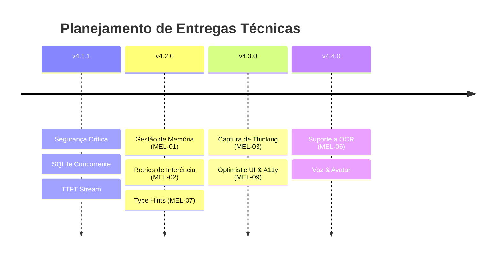

# Relatório de Melhorias & Backlog Técnico — Projeto MARIA

**Versão:** v4.1.1  
**Última atualização:** 2026-08-31  
**Stack Técnica:** Python 3.11+, Flask (Bridge HTTP/Token), Tauri v2 + React 18 + TypeScript, SQLite (WAL + FTS5), `llama-server` (`qwen2.5-omni-3b`)  

---

## 1. Sumário Executivo & Matriz de Rastreabilidade

Este documento consolida o diagnóstico técnico do monorepo **MARIA**, rastreando as melhorias de engenharia já implementadas até a versão **v4.1.1** e detalhando as propostas arquiteturais que compõem o backlog técnico para as próximas versões (**v4.2+**).

### Matriz de Status das Propostas

| ID | Área / Proposta | Prioridade | Status | Módulo / Destino |
|---|---|---|---|---|
| **MEL-01** | Limpeza de Recursos e GC Explícito | 🔴 Alta | 📋 Backlog | `backend/main.py`, `backend/benchmark/` |
| **MEL-02** | Validação de Schema & Retries com Backoff | 🔴 Alta | 📋 Backlog | `backend/core/tools_schema.py`, `llama_client.py` |
| **MEL-03** | Observabilidade de *Thinking* & Métricas | 🔴 Alta | 📋 Backlog | `backend/core/llama_client.py`, `benchmark/` |
| **MEL-04** | Segurança, CORS Restrito & Path Traversal | 🔴 Crítica | ✅ **Concluído (v4.1.1)** | `file_utils.py`, `main.py`, `SEGURANCA.md` |
| **MEL-05** | RAG do Manual de Redação Oficial | 🟡 Média | ✅ **Concluído (v4.1.0)** | `manual_redacao.py`, `schema.sql` (FTS5) |
| **MEL-06** | OCR e Leitura de Documentos Escaneados | 🟡 Média | 📋 Backlog | `backend/core/ocr_handler.py` (Opcional) |
| **MEL-07** | Gestão de Sessões HTTP & Type Hints | 🟡 Média | 📋 Backlog | `core/http_session_manager.py`, `chat_session.py` |
| **MEL-08** | Containerização & Health Checks | 🟡 Média | 📋 Backlog | `backend/Dockerfile` (Deploy Server) |
| **MEL-09** | Frontend: Optimistic UI & Acessibilidade ARIA | 🟢 Baixa | 📋 Backlog | `frontend-tauri/src/` |
| **MEL-10** | Documentação Viva & Padronização SemVer | 🟢 Baixa | ✅ **Concluído (v4.1.1)** | `README.md`, `CHANGELOG.md`, `docs/` |

---

## 2. Melhorias Concluídas nas Versões Recentes

### 2.1. Segurança, Token Atômico e CORS (MEL-04 — v4.1.1)
- **Escrita Atômica**: O token de autenticação bridge é gravado em `.bridge_token.tmp` e substituído atomicamente via `os.replace()`, prevenindo condições de corrida na inicialização simultânea do frontend Tauri.
- **CORS por Ambiente**: Configuração restrita em produção para `tauri://localhost` e `http://tauri.localhost`. Acesso de servidores Vite dev (`http://localhost:5173`) restrito a `MARIA_ENV=development`.
- **Mitigação de PATH Hijacking**: Validação de caminhos seguros e restrição de binários externos ao diretório configurado em `WHISPER_ALLOWED_DIR`.
- **SQLite Concorrente**: Padrão *double-checked locking* com `threading.Lock()` e `PRAGMA busy_timeout = 5000` para operação em Flask multi-threaded.

### 2.2. RAG do Manual de Redação da Presidência da República (MEL-05 — v4.1.0)
- **Indexação FTS5 Nativa**: Ingestão idempotente de **255 trechos** estruturados na tabela virtual `manual_redacao_fts` com tokenizer `unicode61 remove_diacritics 2`.
- **Ferramenta `consultar_manual_redacao`**: Encadeamento automático antes da criação de documentos oficiais, garantindo aderência estrita às normas do padrão ofício da Presidência da República.

### 2.3. Documentação e Padronização SemVer (MEL-10 — v4.1.1)
- **README e CHANGELOG Unificados**: Documentação de alto padrão na raiz com tabela de recursos, guia visual e histórico no formato *Keep a Changelog*.
- **Estrutura `docs/` Higienizada**: Eliminação de duplicatas e unificação do Guia de Instalação.

---

## 3. Backlog Técnico — Propostas para Implementação (v4.2+)

---

### 3.1. [MEL-01] Gerenciamento de Memória e Cleanup Explícito

#### Problema
Em benchmarks com dezenas de tarefas ou em execuções ininterruptas do backend, o processo Python pode acumular memória residente caso conexões HTTP e referências cíclicas não sejam liberadas.

#### Solução Proposta

```python
# backend/main.py — Método de finalização explícita no MariaController

def finalizar(self) -> None:
    """
    Realiza a liberação explícita de recursos e força o ciclo de coleta
    de lixo após tarefas pesadas ou no encerramento da sessão.
    """
    logger.debug("Finalizando MariaController e liberando recursos...")
    
    # 1. Fechar conexões HTTP abertas
    if hasattr(self, "cliente") and self.cliente is not None:
        if hasattr(self.cliente, "_session"):
            try:
                self.cliente._session.close()
            except Exception as e:
                logger.warning(f"Aviso ao fechar sessão HTTP: {e}")
    
    # 2. Limpar referências cíclicas de estado
    self._tool_call_final = None
    self._resposta_textual = ""
    
    # 3. Forçar coleta de lixo explícita
    import gc
    gc.collect()
    logger.debug("Garbage collection executado.")
```

---

### 3.2. [MEL-02] Confiabilidade de Tool Calling: Retries com Backoff e Validação de Schema

#### Problema
Flutuações de latência ou timeouts transitórios na inferência local podem fazer com que uma chamada de ferramenta válida falhe sem tentativa de recuperação automática.

#### Solução Proposta

```python
# backend/core/resilience.py — Decorator genérico de retry com backoff exponencial

import time
import logging
from functools import wraps
from typing import Callable, Any

logger = logging.getLogger(__name__)

def retry_with_backoff(
    max_retries: int = 2,
    base_delay: float = 1.0,
    max_delay: float = 8.0,
    exceptions: tuple = (Exception,)
) -> Callable:
    """Aplica retry com backoff exponencial para chamadas de inferência."""
    def decorator(func: Callable) -> Callable:
        @wraps(func)
        def wrapper(*args: Any, **kwargs: Any) -> Any:
            last_exception = None
            for tentativa in range(max_retries + 1):
                try:
                    return func(*args, **kwargs)
                except exceptions as exc:
                    last_exception = exc
                    if tentativa == max_retries:
                        break
                    delay = min(base_delay * (2 ** tentativa), max_delay)
                    logger.warning(
                        f"Tentativa {tentativa + 1}/{max_retries + 1} de {func.__name__} falhou: {exc}. "
                        f"Novo retry em {delay:.1f}s..."
                    )
                    time.sleep(delay)
            raise last_exception
        return wrapper
    return decorator
```

---

### 3.3. [MEL-03] Observabilidade: Captura de Tokens de Raciocínio (*Thinking*)

#### Problema
Modelos que suportam tokens de raciocínio interno (como Qwen 2.5 / DeepSeek R1) geram nós de pensamento no payload que atualmente são ignorados na extração de texto.

#### Solução Proposta

```python
# backend/core/llama_client.py — Captura de reasoning_content

def _extrair_conteudo_e_pensamento(self, choice: dict) -> tuple[str, str]:
    """Extrai o texto final e o bloco de raciocínio intermediário do modelo."""
    message = choice.get("message", {})
    conteudo = message.get("content") or ""
    pensamento = (
        message.get("reasoning_content") 
        or message.get("thinking") 
        or ""
    )
    if pensamento:
        logger.debug(f"[LLM Thinking] {pensamento[:300]}...")
    return conteudo, pensamento
```

---

### 3.4. [MEL-06] OCR e Processamento de Documentos Escaneados (Opcional)

#### Problema
Documentos em PDF escaneados ou imagens contendo formulários/tabelas não podem ser lidos diretamente por bibliotecas puras de texto.

#### Solução Proposta

```python
# backend/core/ocr_handler.py — Extração de texto via Tesseract

from pathlib import Path
import logging

logger = logging.getLogger(__name__)

try:
    import pytesseract
    from PIL import Image
    TESSERACT_INSTALADO = True
except ImportError:
    TESSERACT_INSTALADO = False

def extrair_texto_imagem(caminho_imagem: str, idioma: str = "por") -> str | None:
    """Extrai texto de imagem se o Tesseract estiver instalado."""
    if not TESSERACT_INSTALADO:
        logger.info("pytesseract não disponível no ambiente. OCR ignorado.")
        return None
    try:
        imagem = Image.open(caminho_imagem)
        return pytesseract.image_to_string(imagem, lang=idioma).strip()
    except Exception as exc:
        logger.error(f"Erro ao processar OCR em {caminho_imagem}: {exc}")
        return None
```

---

### 3.5. [MEL-07] Gestor Compartilhado de Sessões HTTP & Type Hints Estritos

#### Problema
A instanciação de sessões `requests.Session` espalhada pelos clientes pode ser consolidada em um gerenciador único com pool de conexões e tipagem estrita via `TypedDict`.

#### Solução Proposta

```python
# backend/core/chat_session.py — Tipagem estrita com TypedDict

from typing import TypedDict, Literal

RoleType = Literal["system", "user", "assistant", "tool"]

class MensagemEstruturada(TypedDict):
    role: RoleType
    content: str
    name: str | None
```

---

### 3.6. [MEL-09] Frontend: Optimistic UI e Acessibilidade ARIA

#### Problema
No frontend React, a mensagem do usuário aguarda a resolução do comando IPC antes de aparecer em certos fluxos, e faltam atributos ARIA específicos para leitores de tela em mensagens de status pendente.

#### Solução Proposta

```typescript
// frontend-tauri/src/components/ChatMessage.tsx — Suporte a ARIA e status pendente

export function ChatMessage({ role, content, status }: { role: string; content: string; status?: 'pending' | 'ok' | 'error' }) {
  const isPending = status === 'pending';
  return (
    <article
      role="article"
      aria-label={`Mensagem do ${role === 'user' ? 'usuário' : 'assistente'}`}
      aria-live={isPending ? 'polite' : undefined}
      aria-busy={isPending}
      className={`message-card ${role}`}
    >
      {isPending ? (
        <div className="flex items-center gap-2 text-sm text-pink-300">
          <span className="animate-spin">🌀</span>
          <span>Processando solicitação...</span>
        </div>
      ) : (
        <div className="message-content">{content}</div>
      )}
    </article>
  );
}
```

---

## 4. Planejamento de Implementação por Versões



---

## 5. Conclusão

O ecossistema do **MARIA** atingiu um elevado nível de maturidade na versão **v4.1.1**, com seus pilares de segurança, RAG lexical e concorrência consolidados. As melhorias descritas neste relatório formam um roteiro claro e progressivo para elevar a performance, resiliência e acessibilidade do produto nas próximas versões.
